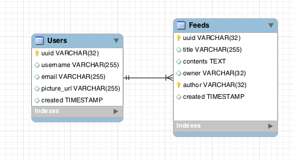
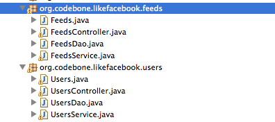
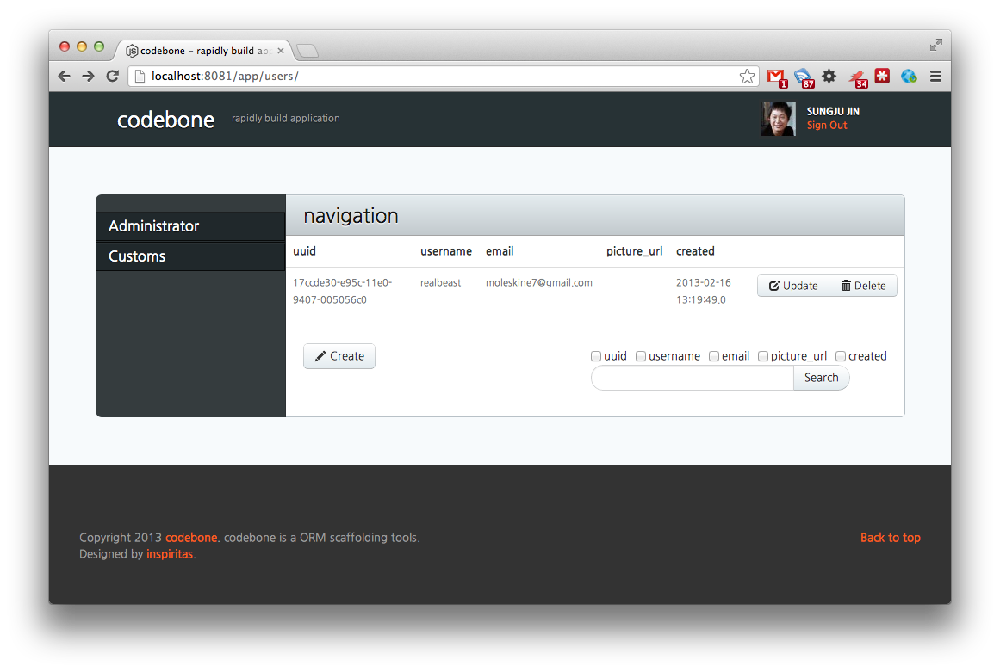

# About

Codebone is a ORM Scaffolding tools. The goal of Codebone rapidly build application.

# Features
* General code generator based on DBMS schema.
* Basic web console based on Spring + Hibernate + Sitemesh
* Automated APIs Documents
* Basic code template
  * CRUD web console pages.
  * REST APIs    

# Requirements

* JDK 1.6 Over.
* Maven

# Getting Started

### Install

```
$ wget http://withmomo.github.com/codebone/release/codebone-0.2.0.zip
$ unzip codebone-0.2.0.zip
```

Need to environment variable `$PATH`, `$CODEBONE_HOME`

```
Mac users
$ export CODEBONE_HOME={your_codebone_home_path}
$ export PATH=$PATH;$CODEBONE_HONE/bin
```
Check it.

```
$ codebone version
codebone version : 0.2.0
```

### Initialize project
```
$ mkdir likefacebook
$ cd likefacebook
$ codebone init
Initialize project...
$ ls -al
total 24
drwxr-xr-x   5 realbeast  staff   170  2 16 11:01 ./
drwxr-xr-x  11 realbeast  staff   374  2 16 11:01 ../
-rw-r--r--   1 realbeast  staff  8638  2 16 11:01 pom.xml
drwxr-xr-x   3 realbeast  staff   102  2 16 11:01 src/
drwxr-xr-x   5 realbeast  staff   170  2 16 11:01 template/
```

### Configure project
```
$ codebone config
Please input your database information.
Select database type : 
1. MYSQL
2. ORACLE
3. POSTGRESQL
4. MSSQL
5. SQLITE
${choose_your_database_type}
Input database host : ${your_database_host}
Input database port : ${your_database_port}
Input database name : ${your_database_name}
Input database username : ${your_database_username}
Input database password : ${your_database_password}
Generated config file : /Users/realbeast/develop/workspace/likefacebook/.codebone
Check site config file : /Users/realbeast/develop/workspace/likefacebook/src/main/resources/codebone.properties
Generated site config file : /Users/realbeast/develop/workspace/likefacebook/src/main/resources/codebone.properties
```
### Run web console
```
mvn jetty:run
```

Launch your browser, and call this url. `http://localhost:8081/app/bootstrap/install` Input administrator information.

### Run automated source generator

```
$ codebone -table ${TABLE_NAME}
```

Example, How to make like a facebook site. DBMS table schema blow this.



* Users
  * uuid - string
  * username - string
  * email - string
  * picture_url - string
  * created - timestamp
* Feeds
  * uuid - string
  * title - string
  * contents - string
  * owner - string
  * author - string
  * created - timestamp
* Friends
  * uuid - string
  * user_uuid - string
  * friend_uuid - string
  * created - timestamp

You can rapidly build web site.

```
$ codebone -table Feeds
OneToMany Detected!
Users 1 -> N Feeds
Codebone will copy this relationship into JPA Model File. copy it? (Y/N) >
Y
Apply the relationship
input Feeds's Package name
(For Example, org.codebone.domain.User)
>org.codebone.likefacebook.feeds
input Feeds's URI Path
For Example, if you want http://localhost:8080/admin/'user'/** URI then press 'user'
if you want just table's name to URI, then press enter
>feeds
input Feeds's Site Title
if you want just table's name to Title, then press enter
>Feeds
input Users's Package name
(For Example, org.codebone.domain.User)
>org.codebone.likefacebook.users
input Users's URI Path
For Example, if you want http://localhost:8080/admin/'user'/** URI then press 'user'
if you want just table's name to URI, then press enter
>users
input Users's Site Title
if you want just table's name to Title, then press enter
>Users
Table Feeds Code Generate Success!
Table Users Code Generate Success!
```

Domain, DAO, Service, Controller classes generated.



`http://localhost:8081/app/users`



Make an awesome your project! ;)

# Contributors
--------------------------------------
* Sunyong Lim
* Sung-ju Jin([@geekbeast](https://twitter.com/geekbeast))
* Hyun-gyu Byun
* Ahn Byunghyun([@anbaeng7](https://twitter.com/anbaeng7))
* SungHoon Moon
* Jin-Young Kim

# Contribute
--------------------------------------
If you would like to contribute code to Codebone you can do so through GitHub by forking the repository and sending a pull request.

# License
--------------------------------------
Codebone is licensed under the MIT.
